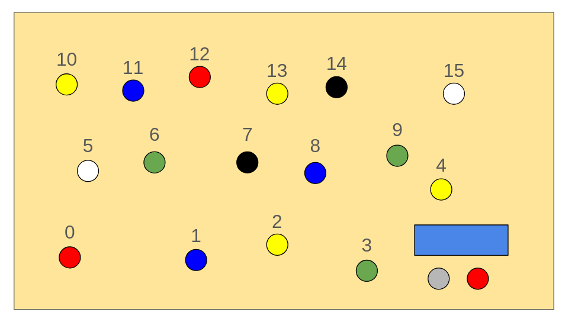

## Components
### Raspberry Pi

* With [DietPi](https://dietpi.com/)
* Access via SSH

### HX711 (Scale)

* 4 load cells are connected to the module
* 2 pins (clock and data) connected to the Raspberry. At each high level on the clock pin, a bit from the weight is read on the data pin
* It can be noisy, so better to do multiple measurements and aggregate them
* To this end, a separate process will handle this
* The scale needs to be calibrated (= get the reference unit, the linear coefficient to go from read value to actual weight ). It was already done
(simply by putting a known weight on the scale and getting its measured value)

### MCP23017 Multiplex

This modules handles all 16 user buttons and is connected to the Raspberry via I2C + an interrupt pin

* The module sends a HIGH signal to the Pi via the interrupt pin when a button is pressed
* To see which button is pressed, we can read "flags", i.e. the value of the two 8-bits register holding the value of the 16 buttons
* The interrupt has to be **reset** once triggered, namely by reading the flags (else it won't trigger again)
* It can happen that between the interrupt and the Pi actually does something, the user un-pressed the button. In this case, the Pi will not be able
to determine which button was pressed

### LCD display

As for the previous module, the LCD is connected to the Pi via I2C. **It is powered by 5V**, instead of 3.3V as all the other devices.
/!\ Only one thread should write to it at a time, or it might start displaying garbage (if so, restart is necessary)

### Rotary encoder + red button

* The Pi can get three infos from there
     - the direction of the rotation (when encoder is rotated)
     - the press of the encode
     - the press of the red button
