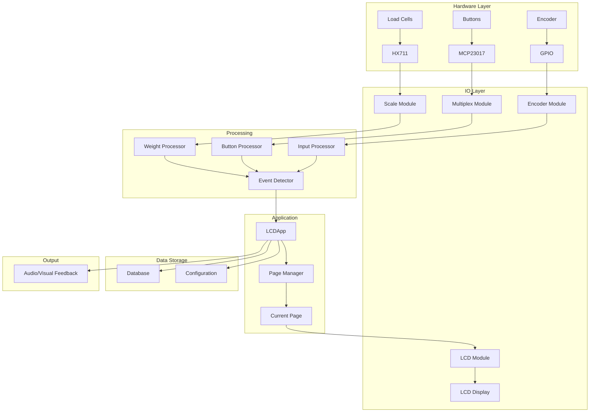
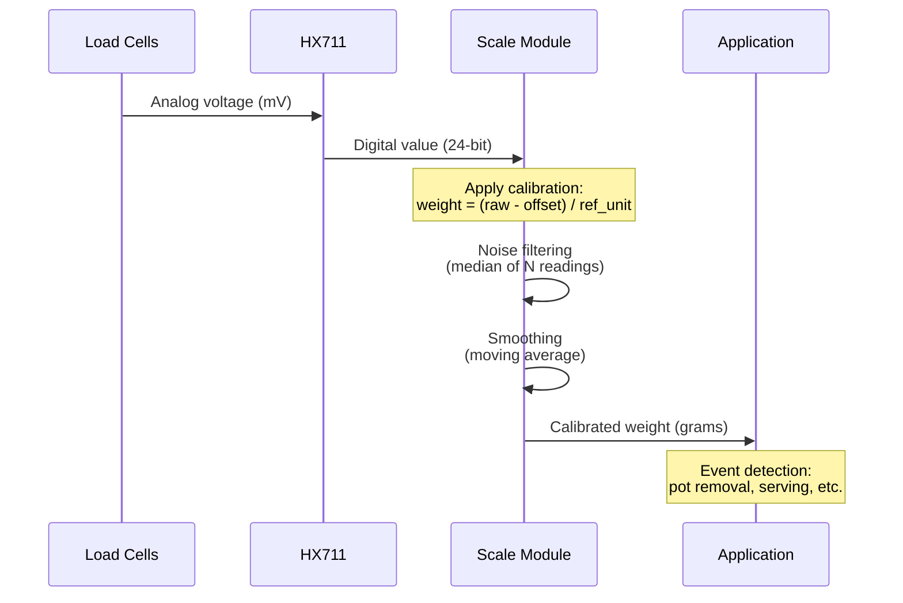
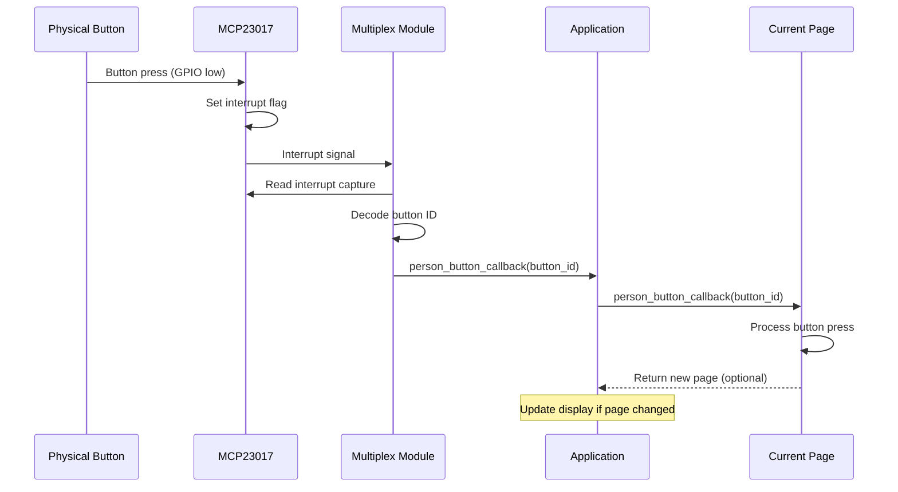
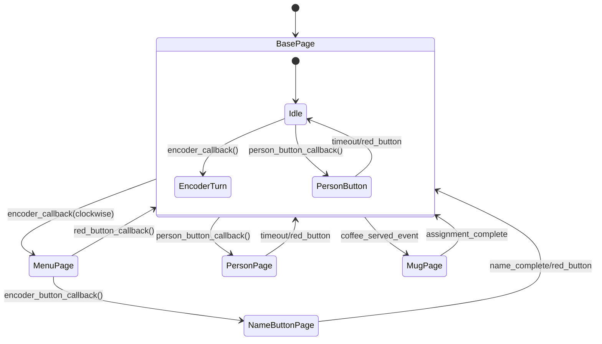
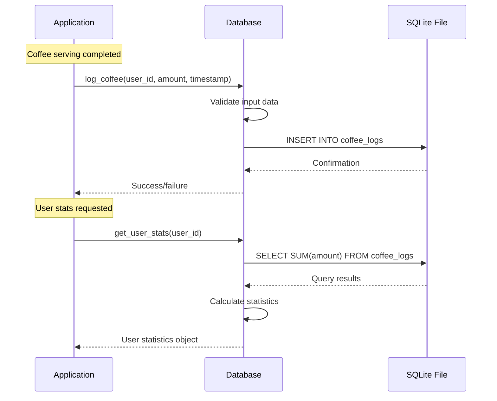
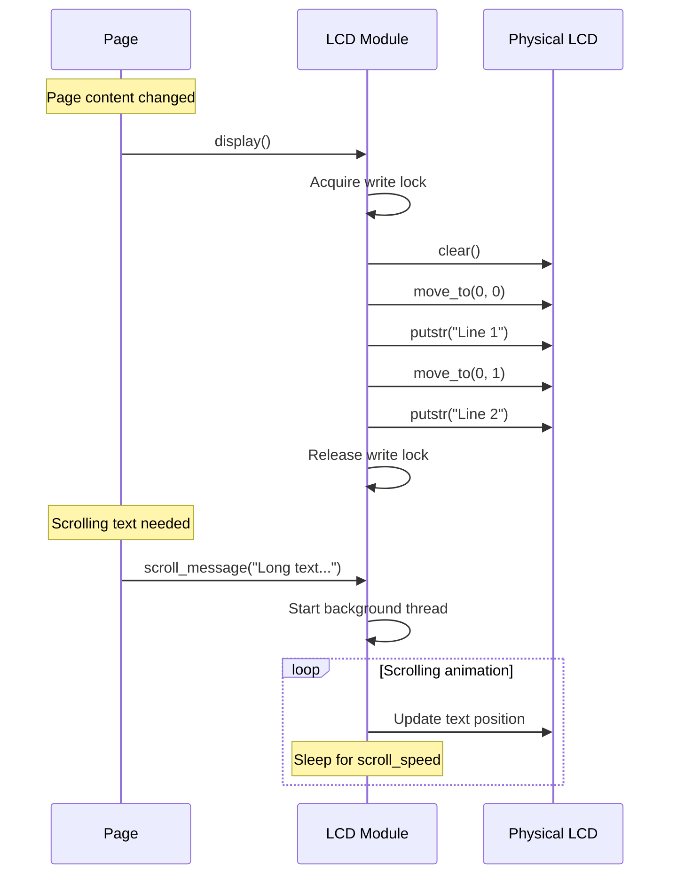
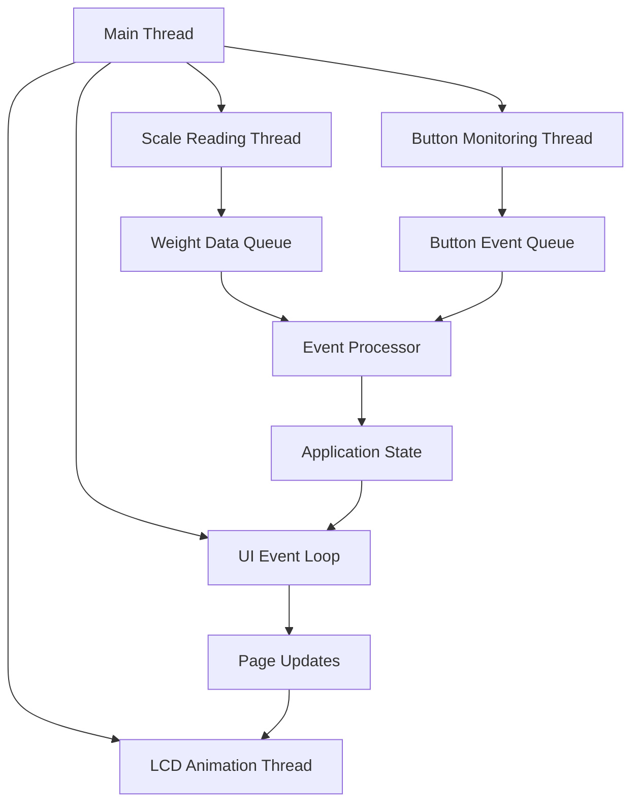

# Data Flow Architecture

Understanding how data flows through the coffee machine system, from sensor inputs to user outputs.

## Overview

The coffee machine system processes multiple data streams in real-time:

- **Sensor Data:** Weight measurements, button presses, encoder input
- **User Data:** Names, consumption logs, preferences  
- **State Data:** Current page, system status, calibration
- **Display Data:** Text, animations, custom characters

## Data Flow Diagram



## Weight Data Flow

### Raw Sensor to Calibrated Weight



### Weight Processing Pipeline

```python
# Weight data processing stages
def process_weight_data(raw_value):
    """Complete weight processing pipeline"""
    
    # Stage 1: Calibration
    calibrated = (raw_value - offset) / reference_unit
    
    # Stage 2: Noise filtering (median filter)
    readings_buffer.append(calibrated)
    filtered = median(readings_buffer[-NUM_READINGS:])
    
    # Stage 3: Smoothing (moving average)
    smooth_buffer.append(filtered)
    smoothed = mean(smooth_buffer[-SMOOTH_WINDOW:])
    
    # Stage 4: Stability analysis
    if is_stable(smooth_buffer):
        stable_value = smoothed
        
    # Stage 5: Event detection
    events = detect_weight_events(smoothed, previous_weight)
    
    return smoothed, stable_value, events
```

### Event Detection Logic

```python
def detect_weight_events(current_weight, previous_weight):
    """Detect coffee machine events from weight changes"""
    
    weight_change = current_weight - previous_weight
    events = []
    
    # Pot removal detection
    if weight_change < -POT_WEIGHT_THRESHOLD:
        events.append({
            'type': 'pot_removed',
            'weight_change': weight_change,
            'timestamp': time.time()
        })
    
    # Serving detection (weight increase after pot removal)
    elif weight_change > MUG_WEIGHT_THRESHOLD and pot_removed:
        events.append({
            'type': 'coffee_served',
            'amount': weight_change,
            'timestamp': time.time()
        })
    
    # Pot return detection
    elif weight_change > POT_WEIGHT_THRESHOLD and pot_removed:
        events.append({
            'type': 'pot_returned',
            'weight_change': weight_change,
            'timestamp': time.time()
        })
    
    return events
```

## Button Input Processing

### Button Matrix to Application Events



### Button Debouncing

```python
class ButtonDebouncer:
    """Handle button debouncing and edge detection"""
    
    def __init__(self, debounce_time=0.05):
        self.debounce_time = debounce_time
        self.last_state = [False] * 16
        self.last_change_time = [0] * 16
    
    def process_button_states(self, current_states):
        """Process raw button states with debouncing"""
        current_time = time.time()
        events = []
        
        for i, (current, previous) in enumerate(zip(current_states, self.last_state)):
            time_since_change = current_time - self.last_change_time[i]
            
            # Only process if enough time has passed
            if time_since_change > self.debounce_time:
                # Rising edge (button press)
                if current and not previous:
                    events.append(('press', i))
                    self.last_change_time[i] = current_time
                
                # Falling edge (button release) 
                elif not current and previous:
                    events.append(('release', i))
                    self.last_change_time[i] = current_time
        
        self.last_state = current_states.copy()
        return events
```

## Page State Management

### Page Transition Flow



### Page Data Inheritance

```python
class PageTransition:
    """Manage page transitions and data passing"""
    
    def __init__(self):
        self.page_stack = []
        self.shared_data = {}
    
    def transition_to_page(self, new_page, carry_data=None):
        """Transition to new page with optional data"""
        
        # Save current page to stack for back navigation
        if hasattr(self, 'current_page'):
            self.page_stack.append(self.current_page)
        
        # Pass data to new page
        if carry_data:
            new_page.receive_data(carry_data)
        
        # Set as current page
        self.current_page = new_page
        new_page.set_lcd(self.lcd)
        new_page.display()
    
    def go_back(self):
        """Return to previous page"""
        if self.page_stack:
            previous_page = self.page_stack.pop()
            self.current_page = previous_page
            previous_page.display()
            return True
        return False
```

## Database Operations

### Data Persistence Flow



### Data Models

```python
class CoffeeLog:
    """Coffee consumption log entry"""
    
    def __init__(self, user_id, amount, timestamp):
        self.user_id = user_id
        self.amount = amount  # grams
        self.timestamp = timestamp
        self.id = None  # Set by database
    
    def to_dict(self):
        return {
            'id': self.id,
            'user_id': self.user_id,
            'amount': self.amount,
            'timestamp': self.timestamp.isoformat()
        }

class UserStats:
    """User consumption statistics"""
    
    def __init__(self, user_id):
        self.user_id = user_id
        self.total_amount = 0
        self.daily_amount = 0
        self.weekly_amount = 0
        self.average_per_day = 0
        self.last_coffee_time = None
        self.coffee_count = 0
    
    def update_from_logs(self, logs):
        """Update statistics from coffee logs"""
        from datetime import datetime, timedelta
        
        now = datetime.now()
        today = now.date()
        week_ago = now - timedelta(days=7)
        
        self.total_amount = sum(log.amount for log in logs)
        self.coffee_count = len(logs)
        
        # Daily amount
        today_logs = [log for log in logs if log.timestamp.date() == today]
        self.daily_amount = sum(log.amount for log in today_logs)
        
        # Weekly amount
        week_logs = [log for log in logs if log.timestamp >= week_ago]
        self.weekly_amount = sum(log.amount for log in week_logs)
        
        # Average per day
        if logs:
            days_since_first = (now - min(log.timestamp for log in logs)).days + 1
            self.average_per_day = self.total_amount / days_since_first
        
        # Last coffee time
        if logs:
            self.last_coffee_time = max(log.timestamp for log in logs)
```

## Display Data Flow

### LCD Update Pipeline



### Text Rendering Pipeline

```python
class DisplayRenderer:
    """Handle text rendering and layout for LCD"""
    
    def __init__(self, width=16, height=2):
        self.width = width
        self.height = height
    
    def render_page(self, page_data):
        """Render page data to LCD format"""
        
        lines = ['', '']  # Initialize display lines
        
        # Title on first line
        if 'title' in page_data:
            lines[0] = self.format_line(page_data['title'], align='left')
        
        # Content on second line
        if 'content' in page_data:
            content = page_data['content']
            
            # Handle different content types
            if isinstance(content, str):
                lines[1] = self.format_line(content, align='left')
            elif isinstance(content, dict):
                lines[1] = self.format_structured_content(content)
        
        return lines
    
    def format_line(self, text, align='left', max_width=None):
        """Format text line with alignment and truncation"""
        max_width = max_width or self.width
        
        # Truncate if too long
        if len(text) > max_width:
            text = text[:max_width-1] + '…'
        
        # Apply alignment
        if align == 'center':
            text = text.center(max_width)
        elif align == 'right':
            text = text.rjust(max_width)
        else:  # left
            text = text.ljust(max_width)
        
        return text
    
    def format_structured_content(self, content):
        """Format structured content (e.g., statistics)"""
        if 'value' in content and 'unit' in content:
            value = content['value']
            unit = content['unit']
            return f"{value}{unit}".ljust(self.width)
        
        return str(content).ljust(self.width)
```

## Real-Time Processing

### Threading Model



### Data Synchronization

```python
import threading
import queue
from collections import namedtuple

# Event types
WeightEvent = namedtuple('WeightEvent', ['type', 'value', 'timestamp'])
ButtonEvent = namedtuple('ButtonEvent', ['type', 'button_id', 'timestamp'])

class EventProcessor:
    """Process events from multiple hardware sources"""
    
    def __init__(self):
        self.weight_queue = queue.Queue()
        self.button_queue = queue.Queue()
        self.running = False
        self.processor_thread = None
        
        # Thread-safe state
        self.state_lock = threading.Lock()
        self.current_weight = 0
        self.pot_present = True
        
    def start_processing(self):
        """Start event processing thread"""
        self.running = True
        self.processor_thread = threading.Thread(
            target=self._process_events,
            daemon=True
        )
        self.processor_thread.start()
    
    def _process_events(self):
        """Main event processing loop"""
        while self.running:
            try:
                # Process weight events (non-blocking)
                try:
                    weight_event = self.weight_queue.get_nowait()
                    self._handle_weight_event(weight_event)
                except queue.Empty:
                    pass
                
                # Process button events (non-blocking)
                try:
                    button_event = self.button_queue.get_nowait()
                    self._handle_button_event(button_event)
                except queue.Empty:
                    pass
                
                time.sleep(0.01)  # 100Hz processing loop
                
            except Exception as e:
                print(f"Event processing error: {e}")
    
    def add_weight_event(self, event_type, value):
        """Add weight event to processing queue"""
        event = WeightEvent(event_type, value, time.time())
        self.weight_queue.put(event)
    
    def add_button_event(self, event_type, button_id):
        """Add button event to processing queue"""
        event = ButtonEvent(event_type, button_id, time.time())
        self.button_queue.put(event)
    
    def _handle_weight_event(self, event):
        """Handle weight-related events"""
        with self.state_lock:
            self.current_weight = event.value
            
            # Detect state changes
            if event.type == 'pot_removed':
                self.pot_present = False
            elif event.type == 'pot_returned':
                self.pot_present = True
    
    def _handle_button_event(self, event):
        """Handle button press events"""
        # Forward to application
        if hasattr(self, 'app'):
            self.app.person_button_callback(event.button_id)
```

## Performance Optimization

### Data Processing Optimization

```python
class OptimizedDataProcessor:
    """Optimized data processing for real-time performance"""
    
    def __init__(self):
        # Pre-allocate buffers
        self.weight_buffer = np.zeros(100)
        self.buffer_index = 0
        self.buffer_full = False
        
        # Cache frequently used calculations
        self.median_cache = {}
        self.last_cache_clear = time.time()
    
    def add_weight_reading(self, weight):
        """Add weight reading to circular buffer"""
        self.weight_buffer[self.buffer_index] = weight
        self.buffer_index = (self.buffer_index + 1) % len(self.weight_buffer)
        
        if self.buffer_index == 0:
            self.buffer_full = True
    
    def get_filtered_weight(self, window_size=5):
        """Get median-filtered weight value"""
        # Use cache if available
        cache_key = (self.buffer_index, window_size)
        if cache_key in self.median_cache:
            return self.median_cache[cache_key]
        
        # Calculate median
        if self.buffer_full:
            start_idx = (self.buffer_index - window_size) % len(self.weight_buffer)
            if start_idx + window_size <= len(self.weight_buffer):
                window = self.weight_buffer[start_idx:start_idx + window_size]
            else:
                # Handle wrap-around
                window = np.concatenate([
                    self.weight_buffer[start_idx:],
                    self.weight_buffer[:start_idx + window_size - len(self.weight_buffer)]
                ])
        else:
            # Not enough data yet
            available = min(self.buffer_index, window_size)
            window = self.weight_buffer[:available]
        
        result = np.median(window)
        
        # Cache result
        self.median_cache[cache_key] = result
        
        # Clear cache periodically
        if time.time() - self.last_cache_clear > 60:
            self.median_cache.clear()
            self.last_cache_clear = time.time()
        
        return result
```

This data flow documentation provides a comprehensive understanding of how information moves through the coffee machine system, from raw sensor inputs to processed outputs and user interactions.