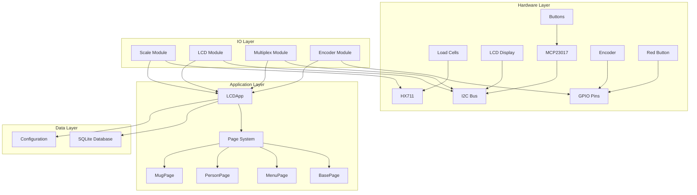
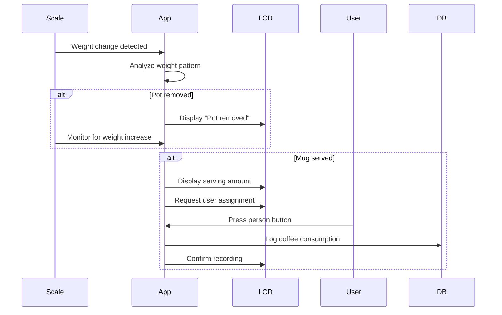
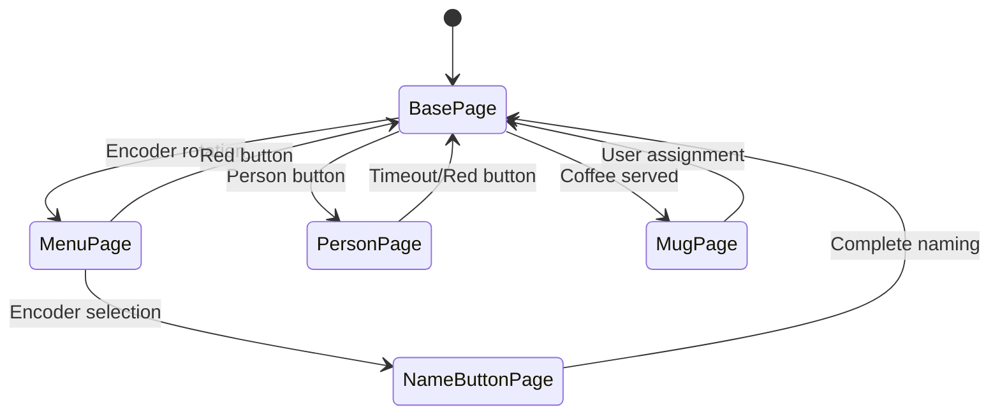

# System Overview

This document provides a high-level overview of the coffee machine system architecture, design principles, and key components.

## Architecture Goals

The system is designed with these principles in mind:

- **Hardware Abstraction:** Clean separation between hardware interfaces and application logic
- **Event-Driven Design:** Reactive system that responds to hardware events
- **Thread Safety:** Safe concurrent access to shared resources
- **Modularity:** Loosely coupled components for maintainability
- **Real-time Responsiveness:** Immediate feedback for user interactions

## System Architecture



## Core Components

### 1. Hardware Interface Layer (`coffee.io`)

Provides abstraction for all hardware components:

- **Scale (`coffee.io.scale`):** HX711 load cell interface with noise filtering
- **LCD (`coffee.io.lcd`):** I2C LCD display with threading safety
- **Multiplex (`coffee.io.multiplex`):** MCP23017 button matrix management
- **Encoder (`coffee.io.encoder`):** Rotary encoder with debouncing

### 2. Application Layer (`coffee.app`)

Manages the user interface and business logic:

- **LCDApp (`coffee.app.app`):** Main application controller
- **Page System (`coffee.app.page`):** UI state management
- **Database (`coffee.app.db`):** Data persistence layer

### 3. Configuration (`coffee.config`)

Centralized configuration management for:
- Hardware pin assignments
- Timing parameters
- Weight thresholds
- Display settings

## Data Flow

### Coffee Serving Workflow



### User Interaction Flow



## Threading Model

The system uses multiple threads for responsive operation:

### Main Thread
- Application UI logic
- Page management
- Event handling

### Scale Reading Thread
- Continuous weight monitoring
- Data filtering and smoothing
- Weight event detection

### LCD Thread
- Display updates
- Text scrolling animations
- Thread-safe display operations

### Thread Safety

Critical sections are protected using:
- **Locks:** For shared data structures
- **Decorators:** For LCD display operations
- **Thread-safe queues:** For inter-thread communication

## Event System

### Hardware Events

Events flow from hardware to application:

```python
# Example event flow
def interrupt_callback():
    """Button press detected"""
    flags_a, flags_b = mcp.read_interrupt_capture()
    button_id = pressed_button_id(flags_a, flags_b)
    app.person_button_callback(button_id)
```

### Page Callbacks

Pages respond to events by returning new pages:

```python
def encoder_callback(self, clockwise: bool) -> Page:
    """Handle encoder rotation"""
    if clockwise:
        return NextPage()
    else:
        return PreviousPage()
```

## Design Patterns

### 1. State Pattern
Pages represent different UI states with their own behavior.

### 2. Observer Pattern  
Components register callbacks for hardware events.

### 3. Decorator Pattern
LCD operations are wrapped for thread safety.

### 4. Template Method
Base page class defines common behavior, subclasses implement specifics.

## Error Handling

### Hardware Failures
- Graceful degradation when sensors fail
- Retry logic for transient I2C issues
- Clear error messages on LCD

### Software Errors
- Exception handling in event callbacks
- Logging for debugging
- Automatic recovery to base page

## Performance Considerations

### Memory Usage
- Circular buffers for sensor data
- Limited page history
- Efficient database queries

### CPU Usage
- Non-blocking I/O operations
- Optimized sensor reading intervals
- Minimal LCD updates

### Real-time Constraints
- 50ms update cycles for responsive UI
- Interrupt-driven button handling
- Background weight monitoring

## Configuration Management

### Hardware Configuration
```python
# coffee/config.py
POT_WEIGHT_THRESHOLD = 80  # grams
NUM_SCALE_READINGS = 5     # readings per measurement
```

### Runtime Configuration
- Dynamic threshold adjustment
- User preference storage
- Calibration data persistence

## Security Considerations

### Physical Security
- No network interfaces exposed
- Local-only operation
- Hardware access required for modification

### Data Security
- Local SQLite database
- No sensitive data stored
- User privacy protection

## Extensibility

The architecture supports easy extension:

### New Hardware
- Implement interface in `coffee.io`
- Add configuration parameters
- Register event callbacks

### New Pages
- Inherit from `Page` base class
- Implement required callbacks
- Add to navigation flow

### New Features
- Add database tables
- Create new page types
- Extend configuration options

## Monitoring and Debugging

### Logging
- Console output for real-time monitoring
- Configurable log levels
- Hardware event tracing

### Diagnostics
- Built-in hardware tests
- Calibration verification
- Performance metrics

## Next Steps

Explore the detailed component documentation:

- [Components](components.md) - Detailed module documentation
- [Data Flow](data-flow.md) - In-depth data flow analysis
- [API Reference](../api/app.md) - Code-level documentation