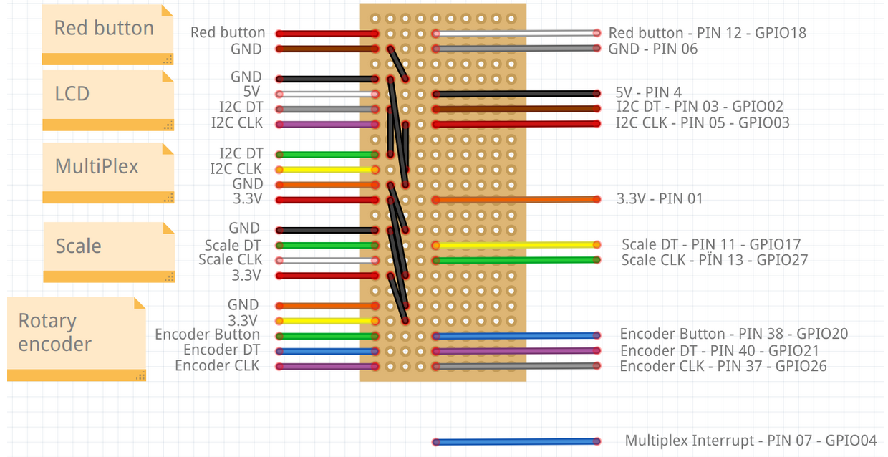

# Hardware Setup

This guide covers the physical setup and wiring of the coffee machine components.

## Core Components

- **Raspberry Pi**
- **HX711 Load Cell Amplifier** - For weight sensing
- **4x Load Cells** - Weight sensors (arranged under coffee machine platform)
- **16x2 LCD Display with I2C** - User interface
- **Rotary Encoder with Button** - Navigation control
- **MCP23017 I2C GPIO Expander** - Button multiplexing
- **17 Push Buttons** - User input (person buttons + red button)

## Wiring Diagrams

Below are the Pin numbers of the raspberry:

And the wiring of all components:

The image above corresponds to the PCB behind the board
