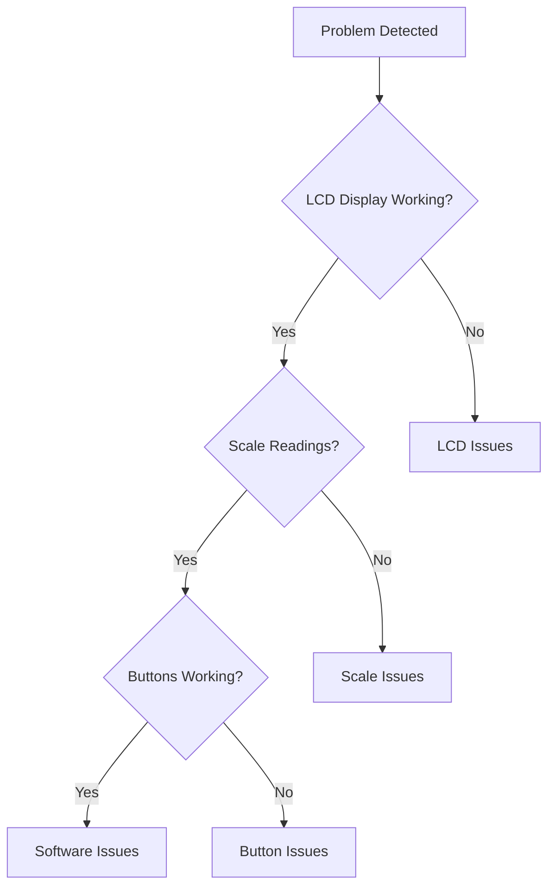

# Troubleshooting

Common issues and solutions for the coffee machine system.

## Quick Diagnosis

Use this flowchart to quickly identify the problem area:



## Hardware Issues

### LCD Display Problems

#### Blank Display

**Symptoms:**
- LCD backlight on but no text
- Complete black screen
- Display partially visible

**Diagnosis:**
```bash
# Check I2C connection
i2cdetect -y 1

# Should show device at 0x27 (or your configured address)
#      0  1  2  3  4  5  6  7  8  9  a  b  c  d  e  f
# 20: -- -- -- -- -- -- -- 27 -- -- -- -- -- -- -- --
```

**Solutions:**

1. **Check Power Supply**
   ```bash
   # Verify 5V power to LCD
   # Check connections: VCC (5V), GND, SDA (GPIO 2), SCL (GPIO 3)
   ```

2. **I2C Address Configuration**
   ```python
   # Try different I2C addresses
   addresses = [0x27, 0x3F, 0x26, 0x20]
   for addr in addresses:
       try:
           lcd = LCD(i2c_addr=addr)
           lcd.putstr("Test")
           print(f"LCD found at address 0x{addr:02X}")
           break
       except:
           continue
   ```

3. **Reset LCD Module**
   ```bash
   # Physical reset
   # 1. Power off Raspberry Pi
   # 2. Disconnect LCD for 10 seconds  
   # 3. Reconnect and power on
   ```

#### Garbled Text

**Symptoms:**
- Random characters displayed
- Text corruption
- Flickering display

**Solutions:**

1. **Clear Display Buffer**
   ```python
   lcd.clear()
   lcd.display_off()
   time.sleep(0.5)
   lcd.display_on()
   lcd.clear()
   ```

2. **Check for Threading Issues**
   ```python
   # Ensure only one thread writes to LCD
   import threading
   lcd_lock = threading.Lock()
   
   def safe_lcd_write(message):
       with lcd_lock:
           lcd.clear()
           lcd.putstr(message)
   ```

3. **Reduce I2C Speed**
   ```bash
   # Add to /boot/config.txt
   dtparam=i2c_arm_baudrate=50000
   ```

### Scale/Weight Sensor Issues

#### No Weight Readings

**Symptoms:**
- Scale always reads zero
- No response to weight changes
- Error messages about scale

**Diagnosis:**
```bash
# Test HX711 connections
python3 -c "
from coffee.io.scale import Scale
scale = Scale()
try:
    reading = scale.read_raw_value()
    print(f'Raw reading: {reading}')
except Exception as e:
    print(f'Error: {e}')
"
```

**Solutions:**

1. **Check Wiring**
   ```
   HX711 → Raspberry Pi
   VCC   → 5V (Pin 2 or 4)
   GND   → Ground (Pin 6, 9, 14, 20, 25, 30, 34, 39)
   DT    → GPIO 17 (Pin 11)
   SCK   → GPIO 27 (Pin 13)
   ```

2. **Verify Load Cell Connections**
   ```
   Load Cell Wire Colors (typical):
   Red    → E+ (Excitation +)
   Black  → E- (Excitation -)
   White  → A+ (Signal +)
   Green  → A- (Signal -)
   ```

3. **Test with Known Good Configuration**
   ```python
   from hx711v0_5_1 import HX711
   
   # Direct HX711 test
   hx = HX711(17, 27)  # Data pin, Clock pin
   hx.setReadingFormat("MSB", "MSB")
   hx.autosetOffset()
   
   for i in range(10):
       raw = hx.getRawBytes()
       value = hx.rawBytesToLong(raw)
       print(f"Reading {i}: {value}")
       time.sleep(1)
   ```

#### Unstable Weight Readings

**Symptoms:**
- Large variations in consecutive readings
- Drifting baseline
- Noise in measurements

**Solutions:**

1. **Increase Smoothing**
   ```python
   # In coffee/config.py
   NUM_SCALE_READINGS = 10        # Increase from 5
   LEN_SCALE_BUFFER = 5          # Increase from 3
   SMOOTHING_WINDOW = 7          # Increase from 3
   ```

2. **Check Mechanical Setup**
   ```bash
   # Ensure platform is:
   # - Level and stable
   # - Not touching other surfaces
   # - Load cells properly mounted
   # - No mechanical binding
   ```

3. **Electrical Interference**
   ```bash
   # Move away from:
   # - Motors and relays
   # - Switching power supplies
   # - Wireless devices
   # - Fluorescent lights
   ```

### Button/Input Issues

#### Buttons Not Responding

**Symptoms:**
- No response to button presses
- Intermittent button behavior
- Wrong buttons triggering

**Diagnosis:**
```bash
# Check MCP23017 on I2C bus
i2cdetect -y 1
# Should show device at 0x20

# Test button matrix directly
python3 -c "
from coffee.io.multiplex import Multiplex
mcp = Multiplex()
print('Press buttons - should see state changes')
while True:
    porta = mcp.read_port_a()
    portb = mcp.read_port_b()
    print(f'Port A: {porta:08b}, Port B: {portb:08b}')
    time.sleep(0.1)
"
```

**Solutions:**

1. **Check Wiring**
   ```
   MCP23017 → Raspberry Pi
   VCC      → 3.3V (Pin 1 or 17)
   GND      → Ground (Pin 6, 9, 14, 20, 25, 30, 34, 39)
   SDA      → GPIO 2 (Pin 3)
   SCL      → GPIO 3 (Pin 5)
   INTA     → GPIO 4 (Pin 7) [Interrupt]
   ```

2. **Verify Button Connections**
   ```
   Each button:
   One side → MCP23017 GPIO pin (GPA0-GPA7, GPB0-GPB7)
   Other side → Ground
   ```

3. **Test Individual Buttons**
   ```python
   import RPi.GPIO as GPIO
   
   # Test buttons connected to Pi directly
   GPIO.setmode(GPIO.BCM)
   GPIO.setup(22, GPIO.IN, pull_up_down=GPIO.PUD_UP)  # Red button
   
   while True:
       if GPIO.input(22) == GPIO.LOW:
           print("Red button pressed")
       time.sleep(0.1)
   ```

#### Encoder Not Working

**Symptoms:**
- No response to encoder rotation
- Encoder button not working
- Erratic behavior

**Solutions:**

1. **Check Encoder Wiring**
   ```
   Encoder → Raspberry Pi
   CLK     → GPIO 23 (Pin 16)
   DT      → GPIO 24 (Pin 18)
   SW      → GPIO 25 (Pin 22)
   VCC     → 3.3V (Pin 1 or 17)
   GND     → Ground
   ```

2. **Test Encoder Directly**
   ```python
   import RPi.GPIO as GPIO
   
   GPIO.setmode(GPIO.BCM)
   GPIO.setup(23, GPIO.IN, pull_up_down=GPIO.PUD_UP)  # CLK
   GPIO.setup(24, GPIO.IN, pull_up_down=GPIO.PUD_UP)  # DT
   GPIO.setup(25, GPIO.IN, pull_up_down=GPIO.PUD_UP)  # SW
   
   def encoder_callback(channel):
       clk = GPIO.input(23)
       dt = GPIO.input(24)
       if clk == 0:
           if dt == 1:
               print("Clockwise")
           else:
               print("Counter-clockwise")
   
   GPIO.add_event_detect(23, GPIO.FALLING, callback=encoder_callback)
   
   while True:
       if GPIO.input(25) == GPIO.LOW:
           print("Encoder button pressed")
       time.sleep(0.1)
   ```

## Software Issues

### Application Crashes

#### Python Import Errors

**Symptoms:**
```
ImportError: No module named 'coffee.io.scale'
ModuleNotFoundError: No module named 'hx711_rpi_py'
```

**Solutions:**

1. **Check Python Path**
   ```bash
   cd /path/to/coffee
   export PYTHONPATH=$PYTHONPATH:$(pwd)
   python scripts/main.py
   ```

2. **Reinstall Dependencies**
   ```bash
   pip uninstall hx711-rpi-py
   pip install hx711-rpi-py
   
   # For C++ dependencies
   sudo apt-get install -y liblgpio-dev
   ```

3. **Virtual Environment Issues**
   ```bash
   # Create new virtual environment
   python3 -m venv coffee_env
   source coffee_env/bin/activate
   pip install -e .
   ```

#### Permission Errors

**Symptoms:**
```
PermissionError: [Errno 13] Permission denied: '/dev/i2c-1'
RuntimeError: Cannot open /dev/gpiomem
```

**Solutions:**

1. **Add User to Groups**
   ```bash
   sudo usermod -a -G i2c,spi,gpio $USER
   sudo usermod -a -G dialout $USER
   
   # Log out and back in for changes to take effect
   ```

2. **Enable Interfaces**
   ```bash
   sudo raspi-config
   # Navigate to Interface Options
   # Enable: I2C, SPI, GPIO
   ```

3. **Check GPIO Daemon**
   ```bash
   sudo systemctl status pigpiod
   sudo systemctl start pigpiod
   sudo systemctl enable pigpiod
   ```

### Database Issues

#### Database Corruption

**Symptoms:**
- SQLite database errors
- Data not saving
- Application crashes on database operations

**Solutions:**

1. **Check Database Integrity**
   ```bash
   sqlite3 scripts/app_data.db "PRAGMA integrity_check;"
   ```

2. **Repair Database**
   ```bash
   # Backup current database
   cp scripts/app_data.db scripts/app_data_backup.db
   
   # Dump and recreate
   sqlite3 scripts/app_data.db ".dump" | sqlite3 scripts/app_data_new.db
   mv scripts/app_data_new.db scripts/app_data.db
   ```

3. **Reset Database**
   ```bash
   # Remove corrupted database (loses all data)
   rm scripts/app_data.db
   
   # Application will create new database on next run
   python scripts/main.py
   ```

## System-Level Issues

### GPIO Conflicts

**Symptoms:**
- Multiple applications claiming same GPIO pins
- Intermittent hardware behavior
- Resource busy errors

**Solutions:**

1. **Check Running Processes**
   ```bash
   sudo lsof /dev/gpiomem
   ps aux | grep python
   ```

2. **Stop Conflicting Services**
   ```bash
   sudo systemctl stop pigpiod
   sudo systemctl stop coffee.service
   
   # Kill any stuck processes
   sudo pkill -f "python.*coffee"
   ```

3. **Reserve GPIO Pins**
   ```bash
   # In /boot/config.txt, add:
   gpio=17,27=op,dh  # Reserve pins 17,27 as outputs
   ```

### I2C Bus Issues

#### Bus Lockup

**Symptoms:**
- I2C devices not responding
- System hangs during I2C operations
- "Resource temporarily unavailable" errors

**Solutions:**

1. **Reset I2C Bus**
   ```bash
   # Disable and re-enable I2C
   sudo modprobe -r i2c-bcm2708
   sudo modprobe i2c-bcm2708
   
   # Or reboot
   sudo reboot
   ```

2. **Check Bus Speed**
   ```bash
   # In /boot/config.txt
   dtparam=i2c_arm_baudrate=100000  # 100kHz (default)
   # Try lower speeds: 50000, 25000
   ```

3. **Manual Bus Recovery**
   ```python
   import smbus
   import time
   
   # Try to reset I2C devices
   bus = smbus.SMBus(1)
   try:
       # Send reset to common addresses
       for addr in [0x20, 0x27]:
           try:
               bus.write_byte(addr, 0x00)
           except:
               pass
   except:
       pass
   finally:
       bus.close()
   ```

## Performance Issues

### Slow Response Times

**Symptoms:**
- Delayed button responses
- Slow LCD updates
- Laggy encoder input

**Solutions:**

1. **Optimize Sensor Reading**
   ```python
   # Reduce reading frequency
   SCALE_SAMPLE_RATE = 5  # Instead of 10 Hz
   
   # Reduce smoothing
   NUM_SCALE_READINGS = 3  # Instead of 5
   ```

2. **Check System Load**
   ```bash
   top
   htop
   iostat 1
   
   # Look for high CPU usage or I/O wait
   ```

3. **Disable Unnecessary Services**
   ```bash
   sudo systemctl disable bluetooth
   sudo systemctl disable wifi-country
   sudo systemctl disable wpa_supplicant
   ```

### Memory Issues

**Symptoms:**
- Out of memory errors
- System becoming unresponsive
- Application crashes under load

**Solutions:**

1. **Check Memory Usage**
   ```bash
   free -h
   sudo dmesg | grep -i "killed process"  # Look for OOM killer
   ```

2. **Increase Swap Space**
   ```bash
   sudo dphys-swapfile swapoff
   sudo nano /etc/dphys-swapfile
   # Set CONF_SWAPSIZE=1024 (for 1GB swap)
   sudo dphys-swapfile setup
   sudo dphys-swapfile swapon
   ```

3. **Optimize Code**
   ```python
   # Use generators instead of lists
   def get_readings():
       while True:
           yield scale.get_reading()
   
   # Limit buffer sizes
   from collections import deque
   readings = deque(maxlen=100)  # Limit to 100 items
   ```

## Diagnostic Tools

### Hardware Test Script

```python
#!/usr/bin/env python3
"""
Comprehensive hardware diagnostic script
"""

import time
import sys
from coffee.io.scale import Scale
from coffee.io.lcd import LCD
from coffee.io.multiplex import Multiplex

def test_i2c_devices():
    """Test I2C device detection"""
    print("Testing I2C devices...")
    
    import subprocess
    result = subprocess.run(['i2cdetect', '-y', '1'], 
                          capture_output=True, text=True)
    print(result.stdout)
    
    # Check for expected devices
    if '20' in result.stdout:
        print("✓ MCP23017 found at 0x20")
    else:
        print("✗ MCP23017 NOT found at 0x20")
    
    if '27' in result.stdout:
        print("✓ LCD found at 0x27")
    else:
        print("✗ LCD NOT found at 0x27")

def test_scale():
    """Test scale functionality"""
    print("\nTesting scale...")
    
    try:
        scale = Scale()
        scale.start_reading()
        time.sleep(2)
        
        readings = []
        for i in range(5):
            reading = scale.get_latest_reading()
            readings.append(reading)
            print(f"Reading {i+1}: {reading:.1f}g")
            time.sleep(1)
        
        # Check stability
        avg = sum(readings) / len(readings)
        max_dev = max(abs(r - avg) for r in readings)
        
        if max_dev < 5:
            print(f"✓ Scale stable (max deviation: {max_dev:.1f}g)")
        else:
            print(f"⚠ Scale unstable (max deviation: {max_dev:.1f}g)")
        
        scale.stop_reading()
        
    except Exception as e:
        print(f"✗ Scale test failed: {e}")

def test_lcd():
    """Test LCD display"""
    print("\nTesting LCD...")
    
    try:
        lcd = LCD()
        lcd.clear()
        lcd.putstr("Test message")
        print("✓ LCD test message displayed")
        
        time.sleep(2)
        lcd.clear()
        
    except Exception as e:
        print(f"✗ LCD test failed: {e}")

def test_buttons():
    """Test button matrix"""
    print("\nTesting buttons...")
    print("Press buttons 0-15, or Ctrl+C to skip")
    
    try:
        mcp = Multiplex()
        pressed_buttons = set()
        start_time = time.time()
        
        while len(pressed_buttons) < 16 and (time.time() - start_time) < 30:
            # Read button states
            porta = mcp.read_port_a()
            portb = mcp.read_port_b()
            
            # Check each button
            for i in range(8):
                if not (porta >> i) & 1:  # Button pressed (inverted)
                    if i not in pressed_buttons:
                        print(f"✓ Button {i} detected")
                        pressed_buttons.add(i)
                
                if not (portb >> i) & 1:  # Button pressed (inverted)
                    button_id = i + 8
                    if button_id not in pressed_buttons:
                        print(f"✓ Button {button_id} detected")
                        pressed_buttons.add(button_id)
            
            time.sleep(0.1)
        
        if len(pressed_buttons) == 16:
            print("✓ All buttons tested successfully")
        else:
            print(f"⚠ Only {len(pressed_buttons)}/16 buttons tested")
        
    except KeyboardInterrupt:
        print("Button test skipped")
    except Exception as e:
        print(f"✗ Button test failed: {e}")

def main():
    """Run all diagnostic tests"""
    print("Coffee Machine Hardware Diagnostic")
    print("=" * 40)
    
    test_i2c_devices()
    test_scale()
    test_lcd()
    test_buttons()
    
    print("\nDiagnostic complete")

if __name__ == "__main__":
    main()
```

### Log Analysis Script

```bash
#!/bin/bash
# analyze_logs.sh - Analyze system logs for coffee machine issues

echo "Coffee Machine Log Analysis"
echo "=========================="

echo "Recent system errors:"
sudo journalctl -p err -n 20 --since "1 hour ago"

echo -e "\nI2C related messages:"
sudo dmesg | grep -i i2c | tail -10

echo -e "\nGPIO related messages:"
sudo dmesg | grep -i gpio | tail -10

echo -e "\nPython application logs:"
sudo journalctl -u coffee.service -n 50 --since "1 hour ago"

echo -e "\nSystem resource usage:"
free -h
df -h
uptime
```

## Getting Help

### Information to Collect

When reporting issues, include:

1. **Hardware Information**
   ```bash
   cat /proc/device-tree/model
   uname -a
   lsb_release -a
   ```

2. **Software Versions**
   ```bash
   python3 --version
   pip list | grep -E "(hx711|gpiozero|mcp23017)"
   ```

3. **Configuration Files**
   ```bash
   cat coffee/config.py
   cat /boot/config.txt | grep -E "(i2c|gpio|spi)"
   ```

4. **Error Messages**
   - Complete error traceback
   - System logs from time of error
   - Hardware diagnostic output

### Contact Information

- **GitHub Issues:** [Create an issue](https://github.com/Thomzoy/coffee/issues)
- **Documentation:** Check other sections of this guide
- **Community:** Discussion forums or chat channels (if available)

### Before Contacting Support

1. Try the diagnostic script
2. Check all connections
3. Verify software installation
4. Review this troubleshooting guide
5. Search existing issues on GitHub